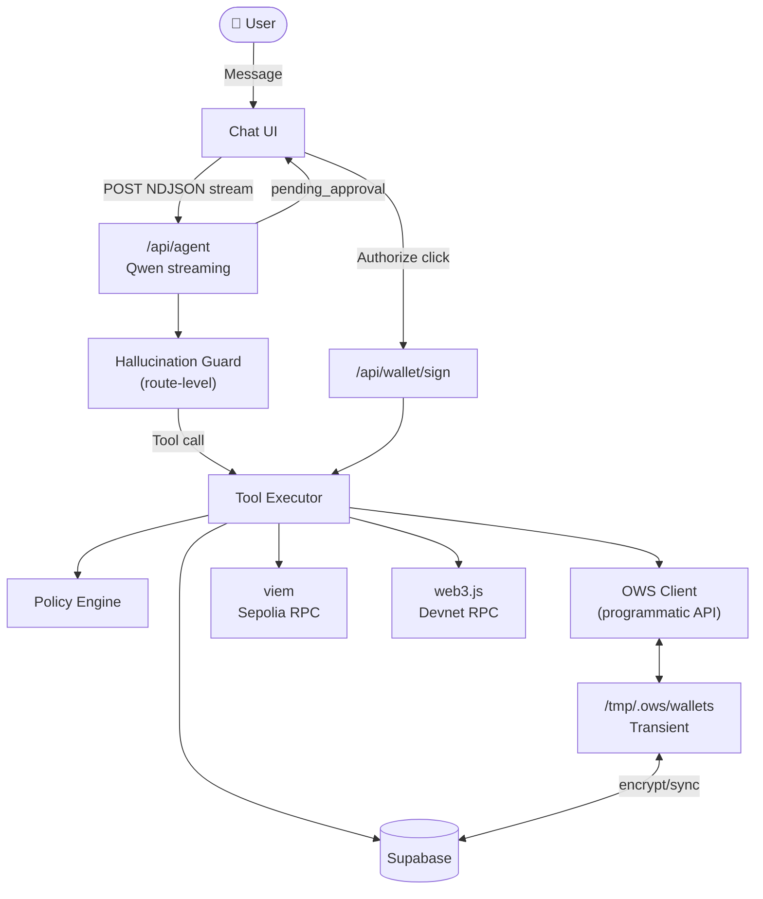
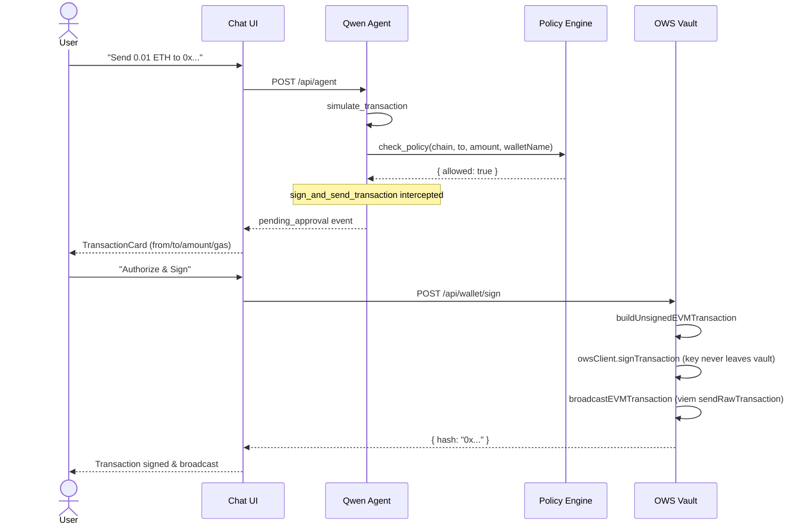
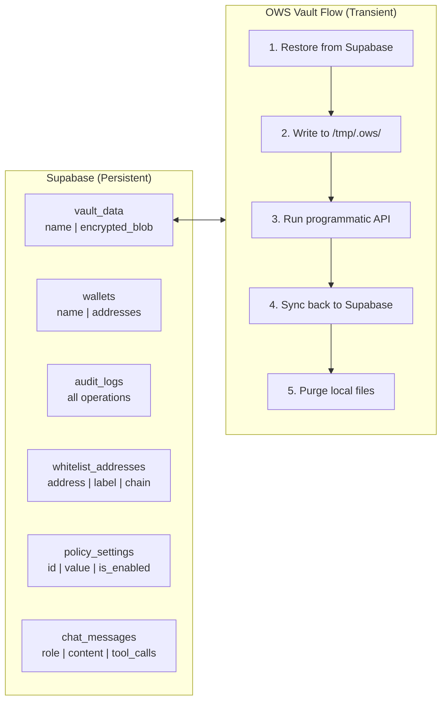

# OWS Treasury Agent — Implementation Summary

## Status

| Area | Status | Notes |
|------|--------|-------|
| OWS vault integration | ✅ | Cloud-native transient pattern via programmatic API |
| Qwen AI agent (11 tools) | ✅ | OpenAI-compatible function calling |
| Transaction approval flow | ✅ | Client-side TransactionCard, no auto-sign |
| EVM broadcast pipeline | ✅ | Build unsigned tx → OWS sign → viem broadcast |
| Hallucination guard | ✅ | Route-level detection + prompt rules |
| Policy engine | ✅ | Supabase-backed, 4 policy types, fail-closed on DB outage |
| Policy Admin UI | ✅ | Whitelist, guardrails, audit log |
| LLM Settings UI | ✅ | Model/base URL selector, persisted in localStorage |
| Markdown rendering | ✅ | Tables, code, bold, lists in AI responses |
| Chat history persistence | ✅ | Supabase chat_messages |
| Audit logging | ✅ | Supabase audit_logs with correct operation names |
| EVM (Sepolia) | ✅ | viem, live balance + simulation + broadcast |
| Solana (Devnet) | ✅ | @solana/web3.js, lamport → SOL conversion |
| DB schema | ⚠️ | Must be created in Supabase manually |

---

## Architecture

### Request Flow



### Transaction Signing Flow



### Storage Architecture



---

## File Structure

```
ows-treasury-agent/
├── app/
│   ├── layout.tsx                    # Root layout (dark mode, fonts)
│   ├── globals.css                   # Theme, markdown styles, scrollbar
│   ├── page.tsx                      # Entry point → ChatWindow
│   ├── dashboard/page.tsx            # Standalone wallet dashboard
│   └── api/
│       ├── agent/route.ts            # Qwen streaming, hallucination guard, intercepts sign calls
│       ├── summary/route.ts          # Dashboard stats
│       └── wallet/
│           ├── create/route.ts
│           ├── list/route.ts
│           ├── balance/route.ts
│           └── sign/route.ts         # Executes approved signing
├── lib/
│   ├── ows/
│   │   ├── client.ts                 # Cloud-native OWS programmatic API wrapper
│   │   ├── signer.ts                 # signAndSend: build → sign → broadcast
│   │   └── policy.ts                 # 4-rule policy engine, fail-closed on DB outage
│   ├── agent/
│   │   ├── tools.ts                  # 11 Zod-validated tool definitions
│   │   ├── executor.server.ts        # Tool execution logic
│   │   └── prompts.ts                # Qwen system prompt with anti-hallucination rules
│   ├── chains/
│   │   ├── evm.ts                    # viem: balance, simulation, build + broadcast
│   │   └── solana.ts                 # web3.js: balance (lamports→SOL), simulation
│   ├── db/
│   │   └── index.ts                  # Supabase client + all table operations
│   └── utils.ts
├── components/
│   ├── chat/
│   │   ├── ChatWindow.tsx            # Main interface: header, messages, input, approval intercept
│   │   ├── MessageBubble.tsx         # User/assistant bubbles with markdown
│   │   ├── MarkdownContent.tsx       # Lightweight markdown renderer
│   │   ├── ToolCallCard.tsx          # Collapsible tool inspector
│   │   ├── TransactionCard.tsx       # Approval UI (Authorize / Terminate)
│   │   └── SimulationDiff.tsx        # Before/after balance visualizer
│   ├── dashboard/
│   │   ├── DashboardSummary.tsx      # Compact 4-stat header bar
│   │   ├── PolicyConfig.tsx          # Whitelist + guardrails + audit log
│   │   └── LLMSettings.tsx           # Model selector + base URL config
│   └── ui/                           # shadcn/ui components
├── store/
│   └── chatStore.ts                  # Zustand: messages, sync, initialize
├── types/
│   └── index.ts                      # All shared TypeScript types
└── next.config.ts                    # serverExternalPackages for OWS NAPI module
```

---

## Agent Tools

| # | Tool | Purpose | Key Input |
|---|------|---------|-----------|
| 1 | `create_wallet` | Generate OWS vault | walletName |
| 2 | `list_wallets` | Show all vaults | — |
| 3 | `get_balance` | Live on-chain balance | walletName, chain |
| 4 | `simulate_transaction` | Gas estimate | chain, to, amount |
| 5 | `check_policy` | Policy gate | chain, to, amount, walletName |
| 6 | `sign_and_send_transaction` | Triggers approval UI | walletName, chain, to, amount |
| 7 | `get_transaction_history` | Audit log query | walletName, chain, limit |
| 8 | `list_whitelist` | Show approved addresses | — |
| 9 | `add_to_whitelist` | Add trusted address | address, label, chain |
| 10 | `remove_from_whitelist` | Remove by ID | id |
| 11 | `update_policy_setting` | Toggle/configure guardrail | id, isEnabled, value |

---

## Policy Engine Rules

Evaluated in order before every transaction:

```
0. DB availability check (fail-closed)
   → Deny if policy_settings returns empty (DB unreachable)

1. Testnet Only (hardcoded, always ON)
   → Deny if chain is not evm/solana/sepolia/devnet

2. Whitelist (Supabase-backed, default OFF)
   → Deny if recipient not in whitelist_addresses for the matching chain

3. Daily Spending Limit (Supabase-backed, default OFF)
   → Deny if amountUSD > limitUSD (default $100)

4. Velocity Limit (Supabase-backed, default OFF, per-wallet)
   → Deny if signs in last hour ≥ maxPerHour (default 3) for this wallet
```

---

## Hallucination Guard

The agent route detects when the LLM outputs a transaction result (long `0x` hash + send/confirm verbs) **without calling any tool**:

1. Checks if hash exists in conversation history — if yes, it's a valid reference, not a fabrication
2. If it's a new hash with no tool call → injects a correction message and forces a re-attempt
3. System prompt rules 7, 8, 9 reinforce the same constraint at model level

---

## Supabase Schema

Run in Supabase SQL Editor before first use:

```sql
create table vault_data (
  name text primary key,
  encrypted_blob text not null
);
create table wallets (
  name text primary key,
  addresses jsonb not null,
  created_at timestamptz default now()
);
create table audit_logs (
  id uuid primary key,
  timestamp timestamptz not null,
  wallet_name text, chain text, operation text, status text,
  tx_hash text, amount text, to_address text,
  policy_result jsonb, user_approved boolean default false
);
create table whitelist_addresses (
  id uuid primary key default gen_random_uuid(),
  address text not null, label text, chain text not null
);
create table policy_settings (
  id text primary key, name text not null,
  value jsonb, is_enabled boolean default false,
  updated_at timestamptz default now()
);
create table chat_messages (
  id uuid primary key, role text not null,
  content text not null, tool_calls jsonb,
  timestamp timestamptz default now()
);
insert into policy_settings (id, name, value, is_enabled) values
  ('spending-limit', 'Daily Spending Limit', '{"limitUSD": 100}', false),
  ('velocity-limit', 'Velocity Limit', '{"maxPerHour": 3}', false);
```

---

## Security Checklist

- ✅ Private keys never leave OWS vault
- ✅ `sign_and_send_transaction` intercepted server-side — client must approve
- ✅ Policy engine runs before approval card is shown
- ✅ Testnet-only hardcoded (cannot be disabled)
- ✅ All operations recorded in audit_logs with correct operation names
- ✅ No secrets in client-side code (API key server-only)
- ✅ TypeScript strict mode throughout
- ✅ Whitelist checks chain type (EVM address cannot pass Solana whitelist)
- ✅ Policy settings DB outage → fail-closed (deny all)
- ✅ Hallucination guard prevents fake tx hashes reaching the user

---

## Known Limitations

| Item | Status |
|------|--------|
| ENS name resolution | Not implemented |
| Token price feed (USD) | Not implemented — amountUSD must be passed manually |
| ERC-20 token balances | Stub returns 0 |
| Solana full transaction building | Partial — signature flow incomplete |
| Mainnet support | Blocked by policy (testnet only) |
| Hardware wallet | Not planned |
| Concurrent vault access | No file locking — concurrent requests to same wallet may race |
