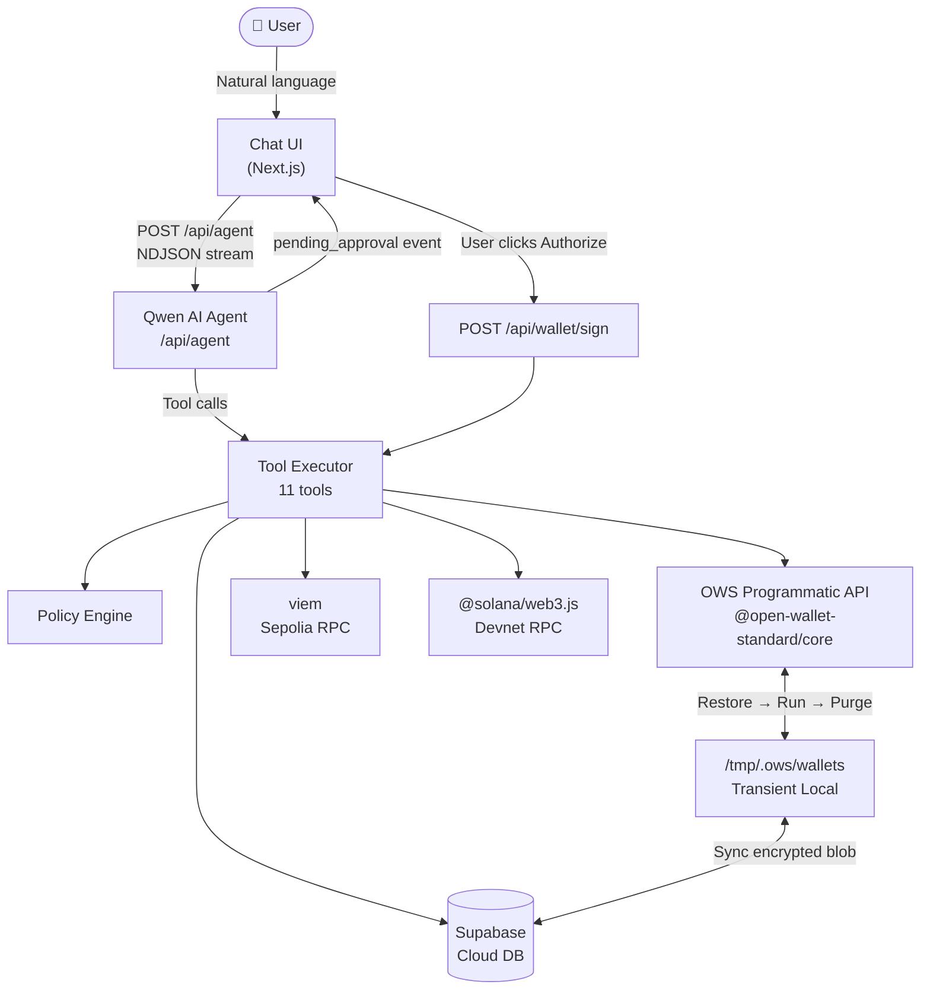
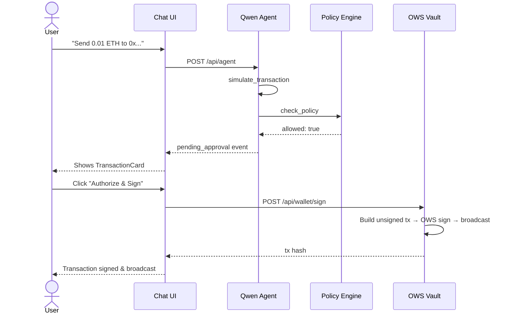
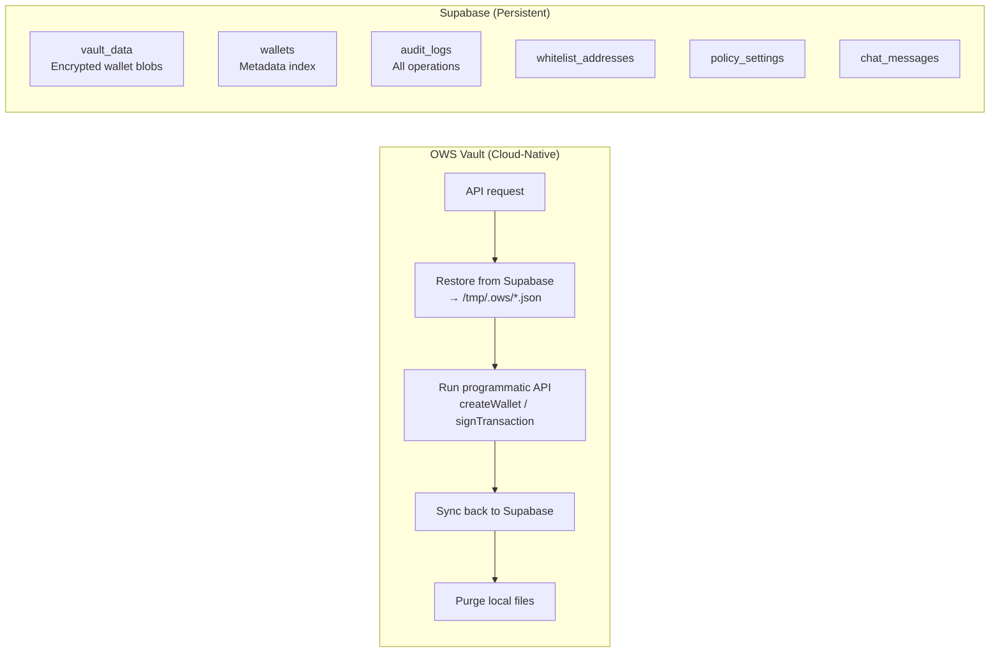

# OWS Treasury Agent

> *"Talk to your wallet like a person. Sign like a vault."*

An AI-powered, policy-gated treasury manager built on the **Open Wallet Standard (OWS)**. Manage assets across Ethereum Sepolia and Solana devnet using natural language — all signing stays inside the OWS encrypted vault.

**Built for the Open Wallet Standard Hackathon.**

---

## How It Works



### Transaction Approval Flow



### Storage Architecture



---

## Features

| Feature | Status | Description |
|---------|--------|-------------|
| Natural language interface | ✅ | Qwen AI with 11 tools |
| Multi-chain support | ✅ | Ethereum Sepolia + Solana Devnet |
| Policy engine | ✅ | Spending limit, velocity, whitelist, testnet-only |
| Transaction simulation | ✅ | Gas preview before signing |
| Client-side approval UI | ✅ | TransactionCard — never auto-signs |
| Secure signing | ✅ | Private keys stay in OWS vault |
| EVM broadcast pipeline | ✅ | Build unsigned tx → OWS sign → viem broadcast |
| Solana broadcast pipeline | ✅ | Build unsigned tx → OWS sign → web3.js broadcast |
| ETH/SOL → USD price feed | ✅ | CoinGecko, auto-calculated for policy checks |
| Transaction History UI | ✅ | History panel with explorer links |
| Password auth gate | ✅ | SITE_PASSWORD env var, session-based |
| User-friendly errors | ✅ | Technical errors mapped to readable messages |
| Wallet backup / export | ✅ | Download encrypted vault blob |
| Policy Admin panel | ✅ | Whitelist management, guardrail configuration |
| LLM Settings panel | ✅ | Switch model (Qwen/GPT) without redeploying |
| Chat history | ✅ | Supabase-persisted across sessions |
| Audit log | ✅ | All operations recorded |
| Hallucination guard | ✅ | Detects & blocks fake transaction results |
| Markdown rendering | ✅ | Tables, code blocks, bold in AI responses |

---

## Tech Stack

| Layer | Technology |
|-------|-----------|
| Framework | Next.js 15 (App Router) |
| Language | TypeScript 5 (strict) |
| Styling | Tailwind CSS 4 + shadcn/ui |
| State | Zustand 5 |
| AI | Qwen via OpenAI-compatible API |
| Wallet | @open-wallet-standard/core (programmatic) |
| EVM | viem 2 (Sepolia) |
| Solana | @solana/web3.js (Devnet) |
| Database | Supabase (all persistence) |
| Validation | Zod 4 |

---

## Quick Start

### Prerequisites

- Node.js 18+ with pnpm
- Qwen API key (Alibaba DashScope International)
- Infura Sepolia RPC endpoint
- Supabase project (free tier works)

### 1. Install

```bash
cd ows-treasury-agent
pnpm install
```

### 2. Set Up Supabase

Run the following SQL in your Supabase project's **SQL Editor**:

```sql
create table vault_data (
  name text primary key,
  encrypted_blob text not null
);

create table wallets (
  name text primary key,
  addresses jsonb not null,
  created_at timestamptz default now()
);

create table audit_logs (
  id uuid primary key,
  timestamp timestamptz not null,
  wallet_name text,
  chain text,
  operation text,
  status text,
  tx_hash text,
  amount text,
  to_address text,
  policy_result jsonb,
  user_approved boolean default false
);

create table whitelist_addresses (
  id uuid primary key default gen_random_uuid(),
  address text not null,
  label text,
  chain text not null
);

create table policy_settings (
  id text primary key,
  name text not null,
  value jsonb,
  is_enabled boolean default false,
  updated_at timestamptz default now()
);

create table chat_messages (
  id uuid primary key,
  role text not null,
  content text not null,
  tool_calls jsonb,
  timestamp timestamptz default now()
);

-- Seed default policy guardrails
insert into policy_settings (id, name, value, is_enabled) values
  ('spending-limit', 'Daily Spending Limit', '{"limitUSD": 100}', false),
  ('velocity-limit', 'Velocity Limit', '{"maxPerHour": 3}', false);
```

### 3. Configure Environment

Create `.env.local`:

```bash
# Qwen AI (use international endpoint)
QWEN_API_KEY=sk-...
QWEN_API_BASE=https://dashscope-intl.aliyuncs.com/compatible-mode/v1
QWEN_MODEL=qwen-max

# RPC Endpoints
NEXT_PUBLIC_EVM_RPC=https://sepolia.infura.io/v3/YOUR_KEY
NEXT_PUBLIC_SOLANA_RPC=https://api.devnet.solana.com

# Supabase
NEXT_PUBLIC_SUPABASE_URL=https://your-project.supabase.co
NEXT_PUBLIC_SUPABASE_ANON_KEY=your-anon-key

# Optional: password gate (omit to disable auth in dev)
SITE_PASSWORD=your-secret-password
```

### 4. Run

```bash
pnpm dev
# → http://localhost:3000
```

---

## Agent Tools (11 total)

| Tool | Description |
|------|-------------|
| `create_wallet` | Create encrypted multi-chain wallet |
| `list_wallets` | List all wallets in vault |
| `get_balance` | Fetch live on-chain balance |
| `simulate_transaction` | Preview gas costs |
| `check_policy` | Validate against spending/chain/whitelist limits |
| `sign_and_send_transaction` | Sign with OWS vault — triggers client approval UI |
| `get_transaction_history` | View audit logs |
| `list_whitelist` | Show approved addresses |
| `add_to_whitelist` | Add trusted recipient |
| `remove_from_whitelist` | Remove by ID |
| `update_policy_setting` | Toggle/configure guardrails |

---

## Policy Engine

Policies are evaluated in order before every transaction:

| Policy | Default | Configurable |
|--------|---------|-------------|
| Testnet only | Always ON | No (hardcoded) |
| Whitelist | OFF | Yes — via Policy Admin |
| Daily spending limit | OFF | Yes — toggle + set $amount |
| Velocity limit (per wallet) | OFF | Yes — toggle + set tx/hour |

If Supabase is unreachable, all transactions are denied by default (fail-closed).

---

## API Reference

| Method | Endpoint | Description |
|--------|----------|-------------|
| POST | `/api/agent` | Streaming Qwen agent (NDJSON) |
| GET | `/api/wallet/list` | List all wallets |
| POST | `/api/wallet/create` | Create new wallet |
| POST | `/api/wallet/balance` | Get wallet balance |
| POST | `/api/wallet/sign` | Execute approved signing |
| GET | `/api/wallet/export?name=...` | Download encrypted vault blob |
| GET | `/api/history` | Fetch audit log (last 50 entries) |
| POST | `/api/auth/verify` | Validate SITE_PASSWORD |
| GET | `/api/summary` | Dashboard stats |

All endpoints require `x-ows-auth: 1` header when `SITE_PASSWORD` is set.

---

## Security Model

```
User Request
    │
    ▼
Qwen Agent decides to call sign_and_send_transaction
    │
    ▼ (agent route intercepts — does NOT execute)
pending_approval event → Client
    │
    ▼
User sees TransactionCard (from, to, amount, gas, policy status)
    │
    ├─── User clicks "Authorize & Sign"
    │         │
    │         ▼
    │    POST /api/wallet/sign
    │         │
    │         ▼
    │    Build unsigned tx (viem) → OWS sign → broadcast
    │    (private key never leaves vault)
    │         │
    │         ▼
    │    Real tx hash returned from chain RPC
    │
    └─── User clicks "Terminate"
              │
              ▼
         Transaction cancelled, no signing occurs
```

- Private keys are **never** accessible to application code
- Every signing operation requires **explicit user click**
- Policy engine runs **before** the approval card appears
- All operations are recorded in **Supabase audit_logs**
- Hallucination guard blocks AI from fabricating fake tx hashes
- Optional password gate (`SITE_PASSWORD`) protects the entire app
- `x-ows-auth` header required on all API calls when auth is enabled
- Technical errors are mapped to user-friendly messages (no raw stack traces)

---

## Testnet Faucets

**Ethereum Sepolia**: https://sepoliafaucet.com

**Solana Devnet**:
```bash
solana airdrop 2 <YOUR_ADDRESS> --url https://api.devnet.solana.com
```

---

## Troubleshooting

| Issue | Solution |
|-------|----------|
| API key 401 error | Check `QWEN_API_KEY` and use `dashscope-intl.aliyuncs.com` (not China endpoint) |
| Policy always blocks | Check Supabase `policy_settings` table has seed rows |
| Whitelist blocks all | Disable whitelist in Policy Admin panel |
| Supabase empty | Run the SQL schema setup above |
| RPC timeout | Verify Infura/RPC URLs in `.env.local` |
| Build error on Vercel | `@open-wallet-standard/core` must be in `serverExternalPackages` in `next.config.ts` |
| Auth 401 on all API calls | Set `SITE_PASSWORD` env var on Vercel, or omit it entirely for dev |
| Password gate loops | Clear sessionStorage (`ows_auth` key) and reload |
| Export returns 404 | Wallet name must match exactly — check Supabase `vault_data` table |

---

## License

MIT — Built for the Open Wallet Standard Hackathon
